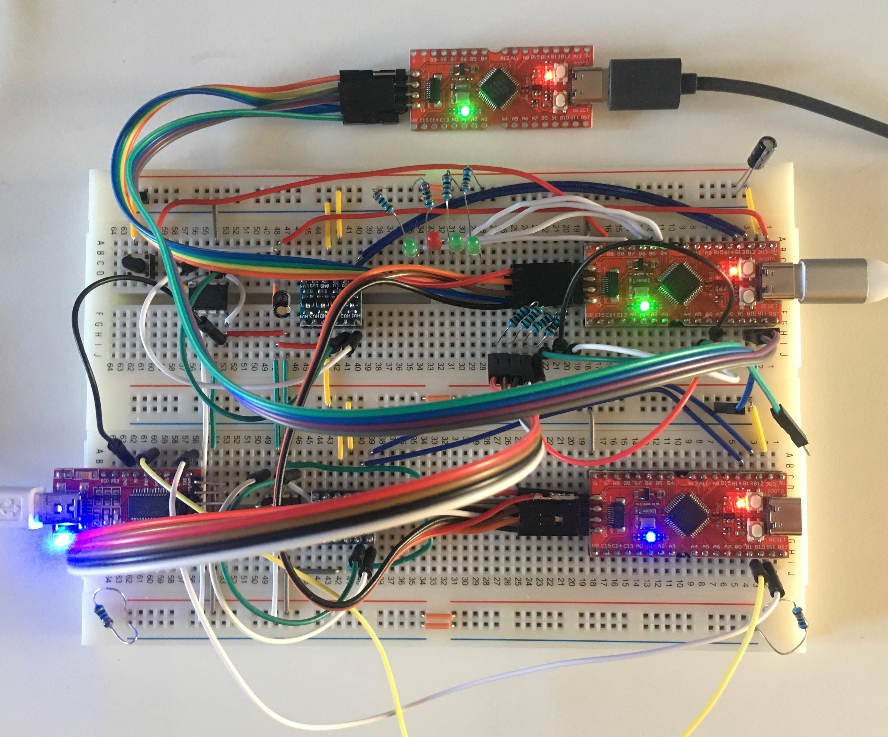

# RV-Link
[](https://travis-ci.com/michahoiting/rv-link)
[](https://gitlab.melroy.org/micha/rv-link/pipelines/latest)

A JTAG emulator/debugger for RISC-V micro-controllers that runs on a RISC-V development board (Sipeed Longan Nano for example). 

>JTAG emulators are the "umbilical cord" between PC software tools and MCU/DSP boards during development. Typically connecting to the host PC via parallel port or USB port, the JTAG emulator provides a standard, simple way to give the development tool software a direct connection to one or more MCU/DSP devices on the target board.

Like [Blackmagic](https://github.com/blacksphere/blackmagic), but designed for RISC-V.

This project is based on the work of Zoomdy's RV-LINK project and is originally forked from the repository at https://gitee.com/zoomdy/RV-LINK.

## Description
The goal of the RV-Link project is to provide the firmware needed to turn a RISC-V development board into a RISC-V emulator, but the RV-Link project does not include any hardware.
Currently the RV-Link firmware runs on the boards listed below.
The firmware can be loaded into the board using the *dfu* or *serial* uploading feature of its boot-loader, or if available, a JTAG emulator (which in turn could be a RV-Link ;-) ).

Different from other emulators: the RV-Link directly interacts with GDB through the USB serial port, and does **not** require an intermediary such as *OpenOCD*.

The development boards that can be used as emulators are:
- Longan Nano, available on Taobao;
- GD32VF103C-START, Taobao.

RISC-V MCU that RV-Link can debug:
- GD32VF103 series.

## Using RV-Link
The RV-Link firmware provides the following features when connected to a RISC-V target:
- **a JTAG interface with gbd-server as USB device**
  e.g. on a Linux host connect to a target board with the following commands:
  ```
  $ riscv32-unknown-gdb <your-application-firmware.elf>
  (gdb) target remote /dev/ttyACM0
  (gbd) load
  (gdb) continue
  ```
- **a USB-to-serial adapter**
  
  ```
  $ pio device monitor -p /dev/ttyACM1 -b 115200
  ```
  Before the USB-to-serial adapter feature can used, it must be activated with the GDB command `mon rvl vcom on` and subsequently the RV-Link must be power cycled to take effect. *Note*, this setting is persistent across power cycles, as it is stored in the build-in Flash memory of the RV-Link.

## More resources
- [Turn the Longan Nano development board into a RISC-V emulator](https://gitee.com/zoomdy/RV-LINK/wikis/%E5%B0%86%20Longan%20Nano%20%E5%BC%80%E5%8F%91%E6%9D%BF%E5%8F%98%E6%88%90%20RISC-V%20%E4%BB%BF%E7%9C%9F%E5%99%A8?sort_id=1667644)
- [Turn the GD32VF103C-START development board into a RISCV-V emulator](https://gitee.com/zoomdy/RV-LINK/wikis/%E5%B0%86%20GD32VF103C-START%20%E5%BC%80%E5%8F%91%E6%9D%BF%E5%8F%98%E6%88%90%20RISCV-V%20%E4%BB%BF%E7%9C%9F%E5%99%A8?sort_id=1667646)
- [GDB uses the RV-LINK simulator to debug RISC-V programs](https://gitee.com/zoomdy/RV-LINK/wikis/GDB%20%E4%BD%BF%E7%94%A8%20RV-LINK%20%E4%BB%BF%E7%9C%9F%E5%99%A8%E8%B0%83%E8%AF%95%20RISC-V%20%E7%A8%8B%E5%BA%8F?sort_id=1667650)
- [Eclipse uses RV-LINK to debug RISC-V programs](https://gitee.com/zoomdy/RV-LINK/wikis/Eclipse%20%E4%BD%BF%E7%94%A8%20RV-LINK%20%E8%B0%83%E8%AF%95%20RISC-V%20%E7%A8%8B%E5%BA%8F?sort_id=1667649)
- [NucleiStudio uses RV-LINK to debug RISC-V programs](https://gitee.com/zoomdy/RV-LINK/wikis/NucleiStudio%20%E4%BD%BF%E7%94%A8%20RV-LINK%20%E8%B0%83%E8%AF%95%20RISC-V%20%E7%A8%8B%E5%BA%8F?sort_id=1667651)
- [Disguise RV-LINK as OpenOCD and enable Peripherals view](https://gitee.com/zoomdy/RV-LINK/wikis/%E5%B0%86%20RV-LINK%20%E4%BC%AA%E8%A3%85%E6%88%90%20OpenOCD%EF%BC%8C%E5%90%AF%E7%94%A8%20Peripherals%20%E8%A7%86%E5%9B%BE?sort_id=1667653)
- [Use Longan Nano as an emulator to debug the Longan Nano development board](http://longan.sipeed.com/zh/get_started/rv-link.html)
- [PlatformIO Unified Debugger » RV-LINK](https://docs.platformio.org/en/latest/plus/debug-tools/rv-link.html)
- [RV-LINK wikis](https://gitee.com/zoomdy/RV-LINK/wikis)
- [Using JTAG on the GD32VF103 using RV-Link](https://gitlab.melroy.org/micha/blogs/-/blob/master/Using-JTAG-on-the-GD32VF103-using-RV-Link/Using-JTAG-on-the-GD32VF103-using-RV-Link.md)

## Building from source
This project currently *only* supports the PlatformIO build system, so you will need to install [PlatformIO](https://docs.platformio.org/en/latest/what-is-platformio.html).

Run the following commands to build all firmware variants and upload the RV-Link firmware to e.g. the Sipeed Longan Nano RISC-V development board:
```
$ pio run
$ pio run -e sipeed-longan-nano -t upload
```
## Wiring the RV-Link to a RISC-V target development board
The pins that are used for the JTAG/TAP hardware interface are configured during the build (determined by *platformio.ini* and *link-config.h*) and are as following:
- **gd32vf103c-start**
  - `TMS = PB12/NSS1, TCK = PB13/SCK1, TDO = PB14/MISO1, TDI = PB15/MOSI1, SRST = PB0/GPIO`
- **sipeed-longan-nano**
  - `TMS = PA13/GPIO, TCK = PA14/GPIO, TDO = PB3/GPIO, TDI = PB15/GPIO, SRST = N/A`
- **sipeed-longan-nano-alt**
  - `TMS = PB12/NSS1, TCK = PB13/SCK1, TDO = PB14/MISO1, TDI=PB15/MOSI1, SRST = PA8/GPIO`
- **rvl-probe**
  - `TMS = PA4/NSS0, TCK = PA5/SCK0, TDO = PA6/MISO0, TDI = PA7MOSI0, SRST = N/A`

Optionally, the `UART0` serial interface of the RV-Link (`TX-PA9`, `RX-PA10`) can be connected to a UART of the target board.

***Note***

>   When the JTAG pins are not properly connected, it is very likely that you will see the following output:
>   ```
>   (gdb) target remote /dev/ttyACM0
>   Remote debugging using /dev/ttyACM0
>   Remote replied unexpectedly to 'vMustReplyEmpty': 
>   RV-LINK ERROR: the target is not connected!
>   RV-LINK v0.2: Longan Nano, configed for GD32VF103 family.
>   ```

### A wiring example
Here is an example of a Sipeed Longan Nano running the RV-Link firmware (*env:sipeed-longan-nano*) that is debugging a Sipeed Longan Nano running the RV-Link firmware (*env:rvl-probe*) that is debugging a third Sipeed Longan Nano running a *blink* application...



## Suggested improvements
This project aims to improve the original RV-LINK firmware with the following features:
- Support for a newly designed hardware board with specific features, called *RVL-Probe*
- Support for JTAG over SPI + DMA;
- Additional diagnostics of the JTAG interface;
- Support for a second USB to serial adapter;
- A *CAN bus* logger;
- Easy updating of the RV-Link firmware;
- Support of running RV-Link on other host platforms (e.g. Linux PC+FT323 / Raspberry Pi);
- Additional `mon` commands;
- Additional NVM configurable items.

## Downloads
[Download firmware artifacts](https://gitlab.melroy.org/micha/rv-link/-/jobs/artifacts/master/download?job=build)

## Notes
[This](https://gitlab.melroy.org/micha/rv-link) repository originally based on the **RV-LINK** project of *Zoomdy* and was forked from the repository at https://gitee.com/zoomdy/RV-LINK at the v0.2.1 tag.
It is mirrored to [GitHub](https://github.com/michahoiting/rv-link) and [Gitee](https://gitee.com/michahoiting/rv-link).
